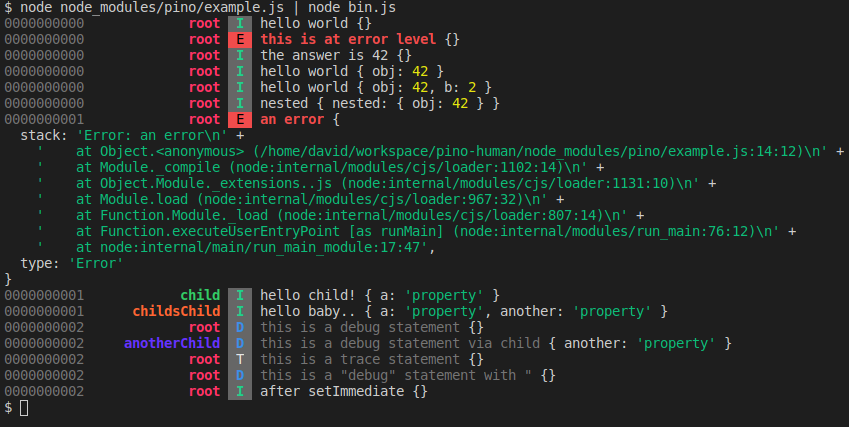

# pino-human
[](https://www.npmjs.com/package/@hydre/pino-human)

A pino ndjson formatter for humans
- Colored
- Fields aligned in columns for easy pattern recognition
- Relative time
- Logger names

## Logger names

This formatter expects to have a `name` json string property in each log line as logger name
```diff
- pino()
+ pino({ base: { name: "logger" }})
```

## Example

Using the [example script](https://github.com/pinojs/pino/blob/fc4c83b/example.js) from the Pino module modified to have logger names,
this will look like:



## Install

```bash
npm install @hydre/pino-human
```

## Usage
```
node app.js | pino-human
```

## License
Unlicense